# Blood Donation Management System

## Project Overview

This project is a desktop application that simplifies blood donation management in hospitals. It allows donors, hospital staff, and administrators to interact with a database that stores information about blood donation processes and records. The application is written in Python and uses MySQL as the backend for data storage. The application is cross-platform and can support multiple platforms using native API calls.

## Features

The application has three levels of administration privileges: Donor, Hospital, and Administrator.

- Donor: A donor can create an account, view their details, and show their willingness to donate blood. They can also update their personal information and health status.
- Hospital: A hospital staff can approve a donor's request and allot them a date for blood donation after validating their health report. They can also view the available blood stock and request blood from other hospitals if needed.
- Administrator: An administrator can view the user details, their blood donation dates, and modify their account details stored in the database. They can also remove accounts from the database or create new user, hospital, or admin accounts as needed.

After a successful donation, the donor will be provided with a proof of their blood donation in a PDF form by the application.

## System Requirements

### Hardware

- CPU: Intel CORE i3 processor (minimum)
- RAM: 1 GB (minimum)
- Display Monitor

### Software

- OS: Windows, Linux, or MacOS
- Language: MySQL and Python
- Libraries: Tkinter and mysql.connector
- Environment: Visual Studio Code Editor, MySQL Workbench, Command Prompt, and MySQL CLI

I see that you have some commands and instructions for installing and running your application. I can help you add these details to your readme file under the installation and usage section. You can also add an image of your application's user interface or a screenshot of the output to make it more appealing. Here is how you can do that:

## Installation and Usage

To install and run the application, follow these steps:

1. Clone or download this repository to your local machine.
2. Install MySQL and MySQL Workbench on your machine and create a database named `blood_donation`.
3. Import the `blood_donation.sql` file from the repository to your database using MySQL Workbench or MySQL CLI.
4. Install Python 3 and the required libraries (Tkinter and mysql.connector) on your machine.
5. Create a virtual environment using the command: `python -m venv myenv`
6. Activate the virtual environment using the command: `source myenv/bin/activate`
7. Install the packages from the `requirements.txt` file using the command: `pip install -r requirements.txt`
8. Open the `main.py` file in Visual Studio Code Editor or any other Python IDE and run it.
9. Enter your username and password to log in to the application. If you don't have an account, you can create one by clicking on the `Register` button.
10. Explore the features of the application according to your role and privileges.
11. Configure your localhost name and password in the `db_creation.py` file.

## Conclusion

This project aims to streamline blood donation management in hospitals through a desktop application. The application's user interface was created using Python libraries such as Tkinter and mysql.connector, with MySQL serving as the backend for data storage. The system is scalable, robust, and resistant to SQL injections due to strict security guidelines. The application's functionality is modular, making it easy to read and track state changes.

## Screenshots:

### WELCOME PAGE

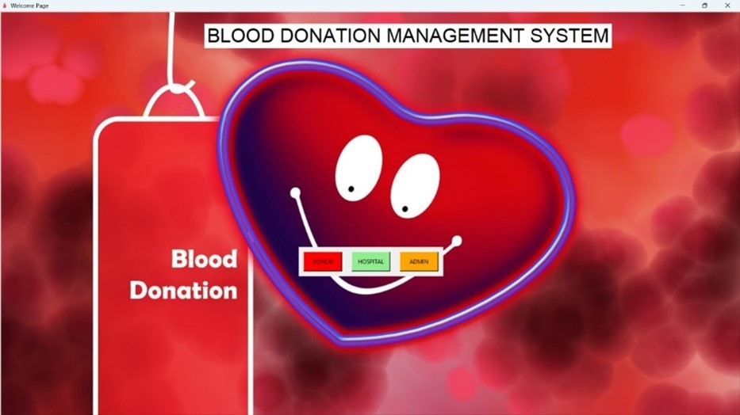

### DONOR FORM PAGE

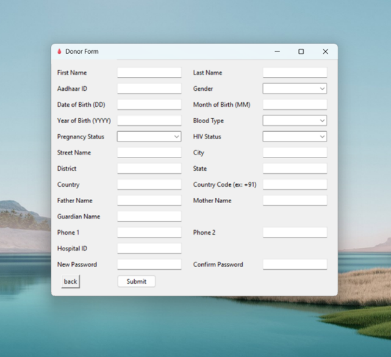

### DONOR LOGIN PAGE

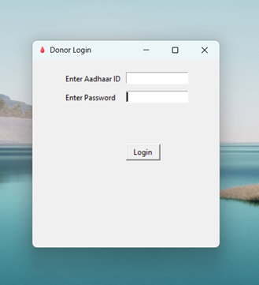

### DONOR TABLE VIEW

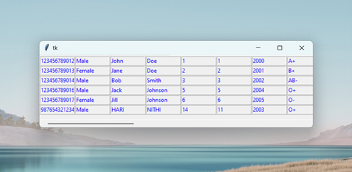

### HOSPITAL FORM PAGE

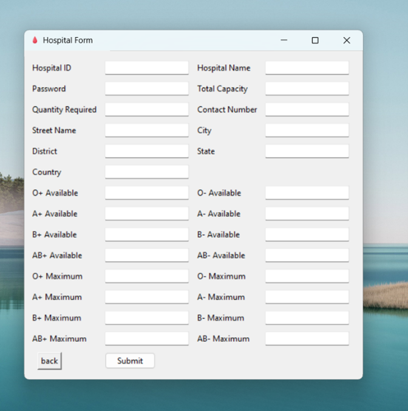

### HOSPITAL LOGIN PAGE

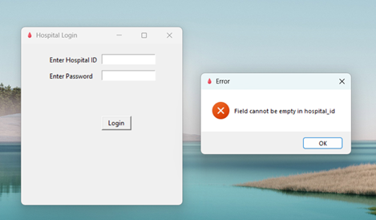

### HOSPITAL TABLE VIEW

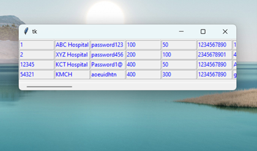

### ADMIN DASHBOARD

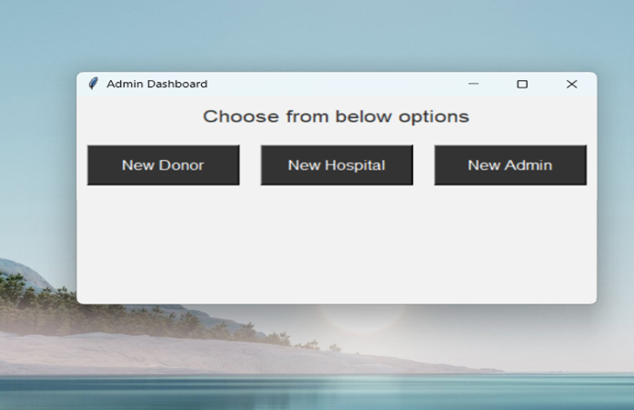

### ADMIN LOGIN PAGE

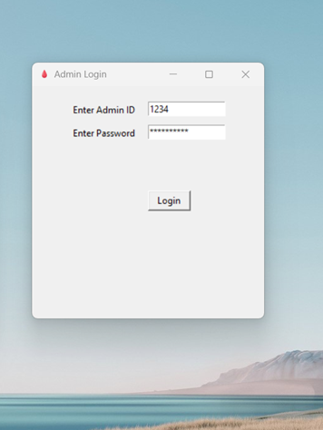

### ADMIN TABLE VIEW

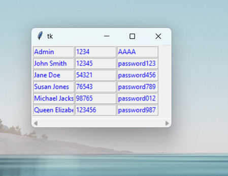

### DATABASE QUERY:

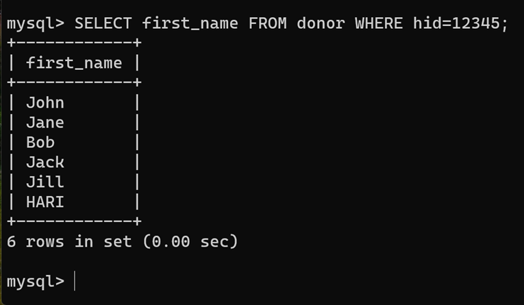

## References

- [Tkinter documentation](https://docs.python.org/3/library/tkinter.html)
- [Tkinter tutorial](https://www.geeksforgeeks.org/python-tkinter-tutorial/)
- [MySQL website](https://www.mysql.com/)
- [MySQL Connector/Python](https://www.mysql.com/products/connector/)
- [MySQL Connector/Python download](https://dev.mysql.com/downloads/connector/python/)
- [Visual Studio Code download](https://code.visualstudio.com/Download)
